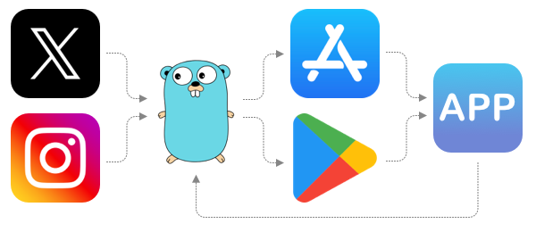

# 🚀 Universal Redirect  
 
 


**Universal Redirect** is a lightweight and efficient server designed to redirect incoming requests to platform-specific URLs. Perfect for directing users to the App Store or Play Store based on their device platform. Additionally, you can append custom metadata to the link and retrieve it in your app.

## 📚 Table of Contents

1. [🚀 Usage](#usage)
2. [⚙️ How It Works](#how-it-works)
3. [🛠️ Installation](#installation)
    1. [📋 Requirements](#requirements)
    2. [📂 Clone the Repository](#clone-the-repository)
    3. [🐳 Docker](#docker)
    4. [🌐 Dokku](#dokku)
4. [⚙️ Configuration](#configuration)
5. [📈 Analytics](#analytics)

## <a name="usage">🚀 Usage</a>

1. Deploy the server on your hosting platform.
2. Create a link using the following format: `https://your-host.com?meta=your-meta`.
3. Redirect users to this link.
4. Retrieve the metadata in your app using a GET request to `https://your-host.com/meta`.

## <a name="how-it-works">⚙️ How It Works</a>

1. The user clicks the link.
2. The server reads the user agent to determine the user's platform and caches the client's IP.
3. The server redirects the user to the appropriate platform-specific URL.
4. Metadata is saved to the Redis cache.
5. The app retrieves the metadata from the Redis cache.

## <a name="installation">🛠️ Installation</a>

### <a name="requirements">📋 Requirements</a>

- Redis server
- Default redirect URL

### <a name="clone-the-repository">📂 Clone the Repository</a>

```bash
git clone https://github.com/ftp27/go-universal-redirect.git
cd go-universal-redirect
```

### <a name="docker">🐳 Docker</a>

#### Build the Container

```bash
docker build -t universal-redirect .
```

#### Run the Container

```bash
docker compose up -d
```

### <a name="dokku">🌐 Dokku</a>

#### Create the App

```bash
dokku apps:create universal-redirect
```

#### Create the Redis Service

```bash
dokku redis:create universal-redirect
dokku redis:link universal-redirect universal-redirect
```

#### Set Configuration

**Required:**

```bash
dokku config:set universal-redirect LINK_DEFAULT=https://example.com
```

**Optional (InfluxDB):**

```bash
dokku config:set universal-redirect INFLUX_TOKEN=... INFLUX_HOST=... INFLUX_DATABASE=...
```

**Optional (Platform-Specific Links):**

```bash
dokku config:set universal-redirect LINK_APPSTORE=https://apps.apple.com LINK_GOOGLEPLAY=https://play.google.com
```

#### Configure Ports

```bash
dokku proxy:ports-add universal-redirect http:80:8080 https:443:8080
```

#### Set Domain (Optional)

```bash
dokku domains:set universal-redirect example.com
```

#### Deploy the App

```bash
git remote add dokku ... # Add the Dokku remote
git push dokku main
```

## <a name="configuration">⚙️ Configuration</a>

Customize the server by setting the following environment variables:

- **`REDIS_URL`** - URL of the Redis server **(required)**
- **`LINK_DEFAULT`** - Default redirect URL **(required)**
- **`LINK_APPSTORE`** - App Store redirect URL __(optional)__
- **`LINK_GOOGLEPLAY`** - Play Store redirect URL __(optional)__
- **`PORT`** - Server port (default: 8080)

For InfluxDB analytics, configure the following variables:

- **`INFLUX_TOKEN`** - InfluxDB token (optional)
- **`INFLUX_HOST`** - InfluxDB host (optional)
- **`INFLUX_DATABASE`** - InfluxDB database (optional)

## <a name="analytics">📈 Analytics</a>

Universal Redirect supports InfluxDB for analytics. It sends each click and install event to the `link` measurement, along with platform and type information (`click` or `install`). Here are some example queries:

- **Total Clicks By Day:**
```sql
SELECT 
  DATE_BIN(INTERVAL '1 day', time, '1970-01-01T00:00:00Z'::TIMESTAMP) AS day, 
  SUM(value) as value 
FROM "link" 
WHERE time >= now() - INTERVAL '30 day' AND type = 'click' 
GROUP BY day
```

```flux
from(bucket: "<bucket_name>")
  |> range(start: v.timeRangeStart, stop: v.timeRangeStop)
  |> filter(fn: (r) => r["_measurement"] == "link")
  |> filter(fn: (r) => r["type"] == "click")
  |> group(columns: [])
  |> aggregateWindow(every: 1d, fn: sum, createEmpty: false)
  |> yield(name: "sum")
```

- **Total Clicks by Platform:**
```sql
SELECT 
  SUM("value") AS "total_value", 
  platform 
FROM "link" 
WHERE time >= now() - INTERVAL '30 day' AND type = 'click' 
GROUP BY platform
```

```flux
from(bucket: "<bucket_name>")
  |> range(start: v.timeRangeStart, stop: v.timeRangeStop)
  |> filter(fn: (r) => r["_measurement"] == "link")
  |> filter(fn: (r) => r["_field"] == "value")
  |> group(columns: ["platform"])
  |> aggregateWindow(every: 1d, fn: sum, createEmpty: false)
  |> yield(name: "sum")
```
